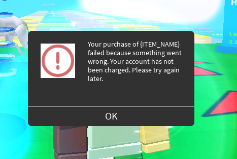
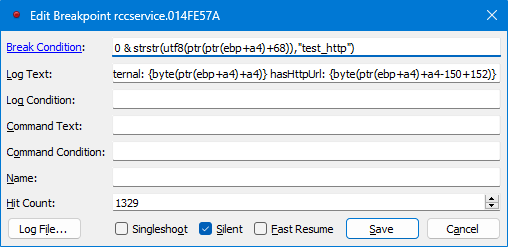

Prepared patches are availble, assuming that [you have ASLR disabled](https://github.com/adamhlt/ASLR-Disabler/releases).

- [[RCC]](v463-rcc.1337)
- [[Player]](v463-player.1337)

# So We Had Gamepass Problems on 2021E...



Rōblox Freedom Distribution is designed to be compatible with whatever server endpoint you use. However, the Rōblox binaries do not always co-operate with our project's design choices.

Such as?

Gamepasses and dev products don't work at all in 2021E (v463).

## Quick Guide for RCC

1. Launch x32dbg.

2. Search for string references to `"CURLOPT_OPENSOCKETFUNCTION"`.

   - You'll find four results; select the first one.

3. Go up about 10 lines and look for disassembly that looks like:

```asm
mov     ecx, rccservice.15047C0
mov     eax, <rccservice.sub_1504A20>
cmovne  eax, ecx
```

4. You will be redirecting execution flow from `15047C0` to `1504A20`.
   - To do this, navigate to the address `15047C0` and replace the first line with `jmp 1504A20`.
   - This works because both methods contain the same signature.

## Quick Guide for Client and Studio

### Part 1

1. Launch x32dbg.

2. Search for string references to `"CURLOPT_OPENSOCKETFUNCTION"`.

   - You'll find _one_ result in the client or _two_ in Studio. **Select the first one**.

3. Go up about 10 lines and find a statement like `mov edx, 0x4EC3` (constant value must match).

4. Shortly before the aforementioned `mov`, change the `je` statement into a `jmp`.

### Part 2

1. Search for user-module references to `"about:blank"`.

   - There will always be one result.
   - In client v463, it is at `014D12B3`.

2. Go up about 6 statements (skipping the unconditional `jmp`) to the most recent `call` routine _and follow its address_:

   - In client v463, it is at `014CED40`.

```
014D129C | E8 9FDAFFFF              | call    robloxplayerbeta.014CED40                                | {FUNCTION TO TARGET}
014D12A1 | 83C4 08                  | add     esp, 0x8                                                 |
014D12A4 | 84C0                     | test    al, al                                                   |
014D12A6 | 0F84 A9010000            | je      robloxplayerbeta.14D1455                                 |
014D12AC | 32DB                     | xor     bl, bl                                                   |
014D12AE | E9 A4010000              | jmp     robloxplayerbeta.14D1457                                 |
014D12B3 | B9 387B1A02              | mov     ecx, robloxplayerbeta.21A7B38                            | 21A7B38:"about:blank"
```

3. Apply the following patch to make the function simply return `1` in all cases.

```patch
- 014CED40 | 55                       | push    ebp                                                      |
- 014CED41 | 8BEC                     | mov     ebp, esp                                                 |
+ 014CED40 | B0 01                    | mov     al, 0x1                                                  |
+ 014CED42 | C3                       | ret                                                              |
014CED43 | 807D 0C 00               | cmp     byte ptr ss:[ebp + 0xC], 0x0                             |
```

### Part 3

1. Search for user-module references to `"HttpRequest.Url is not trusted"`.
   - There will be one result.
   - In client v463, it is at `00C59440`.

```
00C59436 | 68 943EFD01 | push robloxplayerbeta.1FD3E94 | 1FD3E94:"Unrecognized request option %s"
00C5943B | E8 B0228C00 | call robloxplayerbeta.151B6F0 |
00C59440 | 68 B43EFD01 | push robloxplayerbeta.1FD3EB4 | 1FD3EB4:"HttpRequest.Url is not trusted"
00C59445 | E8 A6228C00 | call robloxplayerbeta.151B6F0 |
00C5944A | E8 F451CC00 | call robloxplayerbeta.191E643 |
00C5944F | 68 D43EFD01 | push robloxplayerbeta.1FD3ED4 | 1FD3ED4:"HttpRequest.Priority must be a float"
00C59454 | E8 97228C00 | call robloxplayerbeta.151B6F0 |
00C59459 | 68 C8FAEA01 | push robloxplayerbeta.1EAFAC8 | 1EAFAC8:"Variant cast failed"
00C5945E | E8 8D228C00 | call robloxplayerbeta.151B6F0 |
00C59463 | E8 DB51CC00 | call robloxplayerbeta.191E643 |
00C59468 | 68 FC3EFD01 | push robloxplayerbeta.1FD3EFC | 1FD3EFC:"HttpRequest.Timeout must be a number"
00C5946D | E8 7E228C00 | call robloxplayerbeta.151B6F0 |
00C59472 | 68 C8FAEA01 | push robloxplayerbeta.1EAFAC8 | 1EAFAC8:"Variant cast failed"
00C59477 | E8 74228C00 | call robloxplayerbeta.151B6F0 |
00C5947C | 68 243FFD01 | push robloxplayerbeta.1FD3F24 | 1FD3F24:"HttpRequest.CachePolicy must be an Enum.HttpCachePolicy"
00C59481 | E8 6A228C00 | call robloxplayerbeta.151B6F0 |
00C59486 | 68 C8FAEA01 | push robloxplayerbeta.1EAFAC8 | 1EAFAC8:"Variant cast failed"
00C5948B | E8 60228C00 | call robloxplayerbeta.151B6F0 |
00C59490 | 68 5C3FFD01 | push robloxplayerbeta.1FD3F5C | 1FD3F5C:"HttpRequest.RequestType must be an Enum.HttpRequestType"
00C59495 | E8 56228C00 | call robloxplayerbeta.151B6F0 |
00C5949A | 68 C8FAEA01 | push robloxplayerbeta.1EAFAC8 | 1EAFAC8:"Variant cast failed"
00C5949F | E8 4C228C00 | call robloxplayerbeta.151B6F0 |
```

2. Find references to the address of the `push` statement (in client v463, `00C59440`).

   - In the v463 client, there will be one result (`je 00C59440` at `00C58E43`).
   - If there is no result (as in Studio), you can completely ignore the procedure.

3. Replace the `je` statement with `nop`.

```patch
00C58E41 | 84C0                     | test    al, al                                                   |
- 00C58E43 | 0F84 F7050000            | je      robloxplayerbeta.C59440                                  |
+ 00C58E43 | 90                       | nop                                                              |
+ 00C58E44 | 90                       | nop                                                              |
+ 00C58E45 | 90                       | nop                                                              |
+ 00C58E46 | 90                       | nop                                                              |
+ 00C58E47 | 90                       | nop                                                              |
+ 00C58E48 | 90                       | nop                                                              |
00C58E49 | 8B7D 0C                  | mov     edi, dword ptr ss:[ebp + 0xC]                            |
00C58E4C | 8D4D C4                  | lea     ecx, dword ptr ss:[ebp - 0x3C]                           |
```

## How We Got Here

This took me over a month to complete.

### Preliminary CoreScript Analysis

The CoreScripts describe some of the behaviour shown when a _gamepass_ purchase is initiated.

`Roblox\v463\Studio\Content\LuaPackages\Packages\_Index\roblox_purchase-prompt\purchase-prompt\Thunks\initiatePurchase.lua:69`

```lua
return Promise.all({
	productInfo = getProductInfo(network, id, infoType),
	accountInfo = getAccountInfo(network, externalSettings),
	alreadyOwned = getIsAlreadyOwned(network, id, infoType),
})
```

As shown above, gamepasses require three different APIs to be used:

1. one to get the gamepass metadata,
2. one to get the player's account information (such as robuck balance),
3. and one that checks if a player already owns a gamepass.

The metadata API (1) is called in Lua through a `MarketplaceService` function which _does_ work well.

But the account-info API (2) is accessed through a chain of methods leading up to a call to `HttpService::RequestInternal`:

`Roblox\v463\Studio\Content\LuaPackages\Packages\_Index\roblox_purchase-prompt\purchase-prompt\Services\Network.lua:24`

```lua
return HttpService:RequestInternal(options):Start(function(success, response)
```

---

### `HttpService::RequestInternal`

That one has high security permissions (which [isn't the problem](..\AllScriptsHaveAccessToAllMethods\README.md)).

I was able to trace execution to where the arguments are being unpacked.

And when I connect to any IP address or host which traces back to localhost, it immediately returns an error `Enum.HttpError.ConnectionFail`.

I was also able to trace to where the actual error message is generated.

`Enum.HttpError.ConnectionFail` corresponds to a value of 3.

I discovered through testing that `RequestInternal` works for any hosts and any ports outside `localhost`.

And does throw `SslVerificationError` when sites have expired TLS certs.

Which implies that `CURLOPT_SSL_VERIFYPEER` is not manually set to 0.

Despite the fact that everywhere I found `CURLOPT_SSL_VERIFYPEER` being mentioned I set to 0.

### Setting Up a Testing Environment

After mush research, I discovered that the simplest way to reproduce the problem is to type on the server console:

```lua
game.HttpService:GetAsync('https://localhost:2005')
```

Easier to trace since `HttpService::GetAsync` has already existed in the 2016 source-code bundle:
https://github.com/Jxys3rrV/roblox-2016-source-code/blob/main/App/v8datamodel/HttpService.cpp#L139

Since RFD is already a functional system, I simply set `server_core.startup_script` (a `GameConfig` option) as the following script:

```lua
_G.test_http = function(use_rbxapi: bool)
    local url = "https://localhost:2005/test_http"
    print('testing', url, use_rbxapi)
    if use_rbxapi then
        game.HttpRbxApiService:GetAsyncFullUrl(url)
    else
        game.HttpService:GetAsync(url)
    end
end
local val = true
while wait(3) do
    print(pcall(function() _G.test_http(val) end))
    val = not val
end
```

RFD automatically bootstraps my `server_core.startup_script` option as a CoreScript. Because of this, it can easily reach.

We keep getting this output to print in a loop:

```
testing https://localhost:2005/test_http false
false HttpError: ConnectFail
testing https://localhost:2005/test_http true
false HTTP 404 (Not Found)
```

What?

Notice that when `game.HttpRbxApiService:GetAsyncFullUrl` is called, we get a 404. Un-intuitively, this is a good result because `/test_http` isn't an endpoint implemented in RFD).

But when we do `game.HttpService:GetAsync(url)`, we consistently get `HttpError: ConnectFail`. That is bad because `localhost:2005` is the address of an active running server that we're using.

### Internal `RBX::HttpClient` class

Using IDA, and looking through the v548 PDB files (which some Rōblox reverse-engineers refer to for research), I get the following function signature:

```cpp
void __fastcall RBX::HttpClient::send(
        RBX::HttpClient *this,
        RBX::HttpRequest *req,
        std::function<void __cdecl(enum RBX::HttpErrorCode,RBX::HttpResponse &)> *cb)
```

There is one relevant argument I should focus on: `RBX::HttpClient *this`.

What is `RBX::HttpClient`?

```
00000000 struct __cppobj RBX::HttpRequest : std::enable_shared_from_this<RBX::HttpRequest>
00000000     RBX::HttpRequest_vtbl *__vftable;
00000018     RBX::HttpRequest::RequestConfig config;
00000180     RBX::HttpRequest::TrackingState tracking;
00000260     RBX::HttpRequest::RetryInfo retryInfo;
00000280     RBX::SubsystemScopedHandle<RBX::HttpClient> httpClient;
00000288 };
```

And where do we include some request parameters?

```
00000018     RBX::HttpRequest::RequestConfig config;
```

What is `RBX::HttpRequest::RequestConfig`?

```
00000000 struct __cppobj __declspec(align(8)) RBX::HttpRequest::RequestConfig // sizeof=0x168
00000000 {                                       // XREF: RBX::HttpRequest/r
00000000     std::vector<std::pair<std::string,std::string >> rawHeaders;
00000018     std::string accessToken;
00000038     float prio;
0000003C     // padding byte
0000003D     // padding byte
0000003E     // padding byte
0000003F     // padding byte
00000040     RBX::HttpRequest::RequestConfig::UrlDetails originalUrl;
000000A0     RBX::HttpRequest::RequestConfig::UrlDetails currentUrl;
00000100     std::string method;
00000120     std::string bodyData;
00000140     RBX::HttpCachePolicy cachePolicy;
00000144     int connectTimeoutMillis;
00000148     int individualResponseTimeoutMillis;
0000014C     int totalResponseWithRetriesTimeoutMillis;
00000150     bool isExternalRequest;
00000151     bool hasBody;
00000152     bool hasHttpUrl;
00000153     bool isBackgroundRequest;
00000154     bool isMockingDisabled;
00000155     bool useIpBlacklist;
00000156     // padding byte
00000157     // padding byte
00000158     RBX::HttpContext httpContext;
0000015C     RBX::HttpRequestType requestType;
00000160     int maxRedirects;
00000164     // padding byte
00000165     // padding byte
00000166     // padding byte
00000167     // padding byte
00000168 };
```

---

Any important strings _inside the function `RBX::HttpClient::send`_ we can use as markers for that function?

Here's one:

`"[DFLog::HttpTraceLight] Attempting to call HttpClient::send() during global destruction"`.

---

In the decompiled-by-IDA v548:

```cpp
  if ( this->disabled._Storage._Value && FFlag::g_flagsLoaded && DFFlag::EarlyOutOnHttpRequestSendDuringShutdown.value )
  {
    if ( DFLog::HttpTraceLight )
      FLog::FastLogFormatted(
        DFLog::HttpTraceLight,
        "[DFLog::HttpTraceLight] Attempting to call HttpClient::send() during global destruction");
    return;
  }
```

That same string can be found in x32dbg when I open the v463 `RCCService.exe`:

```
014FE445 | 68 1833AC01 | push rccservice.1AC3318 | 1AC3318:"[DFLog::HttpTraceLight] Attempting to call HttpClient::send() during global destruction"
```

### Hooking x32dbg Logpoints

Yes. In v463 RCC, the function `HttpClient::send()` begins about 15 instructions _prior_ at address `014FE3F0`.

At that address, I added.

- a command breakpoint, and then
- a logpoint

Both were added after the function finishes initialising and setting `ebp`.




The URL string which is passed in can be reached through `utf8(ptr(ptr(ebp+a4)+68))` - keeping in mind that the `a4` and `68` are in hexadecimal.

---

After much research, I learnt that to access `req->config.isExternal` in our v548 would be the same thing as `byte(ptr(ebp+a4)+a4)` in v463 RCC.

If you want to get the offset for yourself,

1. Search for references to `"[DFLog::HttpTraceLight] Attempting to call HttpClient::send() during global destruction"`. You will find yourself in the body of `RBX::HttpClient::send`.

2. Scroll down until you find a block of code that looks something like HTTP headers being added. Analyse the statement in `{TARGET}` and replace the `0xA4` with any value you might need.

```
014FE56C | E8 4F33FFFF              | call    <rccservice.sub_14F18C0>                    |
014FE571 | 50                       | push    eax                                         |
014FE572 | E8 6965FFFF              | call    <rccservice.RBX::Http::isExternalUrl>       |
014FE577 | 83C4 04                  | add     esp, 0x4                                    |
014FE57A | 84C0                     | test    al, al                                      |
014FE57C | 0F85 E2000000            | jne     rccservice.14FE664                          |
014FE582 | 3887 A4000000            | cmp     byte ptr ds:[edi + 0xA4], al                | {TARGET}
014FE588 | 74 0C                    | je      rccservice.14FE596                          |
014FE58A | 3805 A0EEDB01            | cmp     byte ptr ds:[0x1DBEEA0], al                 |
014FE590 | 0F85 CE000000            | jne     rccservice.14FE664                          |
014FE596 | 68 98EADB01              | push    rccservice.1DBEA98                          |
014FE59B | 68 D0EBDB01              | push    rccservice.1DBEBD0                          | 1DBEBD0:&"Roblox-Session-Id"
014FE5A0 | 57                       | push    edi                                         |
014FE5A1 | E8 2ACAFFFF              | call    <rccservice.sub_14FAFD0>                    |
014FE5A6 | 68 B0EADB01              | push    rccservice.1DBEAB0                          | 1DBEAB0:"Test"
014FE5AB | 68 E8EBDB01              | push    rccservice.1DBEBE8                          | 1DBEBE8:"Roblox-Game-Id"
014FE5B0 | 57                       | push    edi                                         |
014FE5B1 | E8 1ACAFFFF              | call    <rccservice.sub_14FAFD0>                    |
014FE5B6 | 68 C8EADB01              | push    rccservice.1DBEAC8                          | 1DBEAC8:"1818"
014FE5BB | 68 00ECDB01              | push    rccservice.1DBEC00                          | 1DBEC00:"Roblox-Place-Id"
014FE5C0 | 57                       | push    edi                                         |
014FE5C1 | E8 0ACAFFFF              | call    <rccservice.sub_14FAFD0>                    |
014FE5C6 | 68 28EBDB01              | push    rccservice.1DBEB28                          | 1DBEB28:"Server"
014FE5CB | 68 18ECDB01              | push    rccservice.1DBEC18                          | 1DBEC18:"Requester"
014FE5D0 | 57                       | push    edi                                         |
014FE5D1 | E8 FAC9FFFF              | call    <rccservice.sub_14FAFD0>                    |
014FE5D6 | 68 E0EADB01              | push    rccservice.1DBEAE0                          |
014FE5DB | 68 60ECDB01              | push    rccservice.1DBEC60                          | 1DBEC60:&"Roblox-Job-Signature"
014FE5E0 | 57                       | push    edi                                         |
014FE5E1 | E8 EAC9FFFF              | call    <rccservice.sub_14FAFD0>                    |
014FE5E6 | FF35 3C6CFB01            | push    dword ptr ds:[0x1FB6C3C]                    |
014FE5EC | 8D45 C4                  | lea     eax, dword ptr ss:[ebp - 0x3C]              |
014FE5EF | 68 2CC38E01              | push    rccservice.18EC32C                          | 18EC32C:"%d"
```

Taking 0x150 as the base offset for `isExternal`, we can find:

- `req->config.hasHttpUrl` at `byte(ptr(ebp+a4)+a4-150+152`, or
- `req->config.totalResponseWithRetriesTimeoutMillis` at `byte(ptr(ebp+a4)+a4-150+14c`

### Finding Differences

Here is a common pattern to look out for:

- `game.HttpRbxApiService:GetAsyncFullUrl(url)` yields an `isExternal` value of `false`, and
- `game.HttpService:GetAsync(url)` yields an `isExternal` value of `true.

Changing the value of `isExternal` _at this point in the execution_ does not seem to affect whether a request yields `ConnectFail`. _No fix there._

Another observation:

- `game.HttpRbxApiService:GetAsyncFullUrl(url)` yields a `requestType` value of `RBX::HttpRequestType::Http_RequestDefault` (0), and
- `game.HttpService:GetAsync(url)` yields a `requestType` value of `RBX::HttpRequestType::Http_RequestHttpService` (3).

Where `requestType` is a property of `RBX::HttpRequest::RequestConfig`.

---

Setting `req->config.totalResponseWithRetriesTimeoutMillis` to `-1` (via `ss:[ptr(ebp+a4)+a4-150+14C]=-1`) gives us an **important** clue. In that case, the RCC output then becomes a loop of:

```
testing https://localhost:2005/test_http false
false HttpError: Unknown, msg: HttpRequestCurl(0AD8D9D0) curl error:43 op:CURLOPT_TIMEOUT_MS msg:A libcurl function was given a bad argument
testing https://localhost:2005/test_http true
false HTTP unknown error (HttpError: Unknown, msg: HttpRequestCurl(0AD8D508) curl error:43 op:CURLOPT_TIMEOUT_MS msg:A libcurl function was given a bad argument)
...
```

Note that this same error occurs with both `game.HttpRbxApiService:GetAsyncFullUrl(url)` and `game.HttpService:GetAsync(url)`.

---

### Interactions with `libcurl`

So the culprit _must_ be in how `libcurl` handles requests.

I added a logpoint to the head of what I think is `curl_easy_setopt`:

```
curl_set_opt {arg(1)} {arg(2)} [{utf8(arg(2))}]
```

In 2021E RCC, I inserted it at address `0152C4C0`.

---

#### Logs for `game.HttpService:GetAsync(url)`

```
curl_set_opt 2774 23C1DE0 [\x06]
curl_set_opt 20 1 []
curl_set_opt 9C 927C0 []
curl_set_opt 9B 1D4C0 [????????????????????????????????????????????????????????????????????????????????????????????????????????????????????????????????????????????????????????????????????????????????????????????????????????????????????????????????????????????????????????????????????????????????????????????????????????????????????????????????????????????????????????????????????????????????????????????????????????????????????????????????????????????????????????????????????????????????????????????????????????????????????????????????]
curl_set_opt 4EC3 15047C0 [U\x8B\xEC\x83\xEC\x18SV\x8Bu\x102\xC92\xFF\x88M\xFFW\x8B\x06\x83\xF8\x02uS\xFFv\x14\x8DF\x10\xC6E\xFF\x01\x89E\xE8\xFF\x15h\x06\x8E\x01\x8B5\x84n\xFB\x01\x8B=\x88n\xFB\x01;\xF7t\x17\x0F\x1F]
curl_set_opt 4EF0 1503620 [U\x8B\xECd\xA1]
curl_set_opt 2776 18E9CB8 []
curl_set_opt 272D C7D42E8 [\xC89\xAC\x01]
curl_set_opt 4E6F 15073D0 [U\x8B\xEC\x8BE\f\x0F\xAFE\x10\x8BM\x14P\xFFu\x08\xE8\x9A\xFC\xFF\xFF]\xC3\xCC\xCC\xCC\xCC\xCC\xCC\xCC\xCCU\x8B\xECV\xFFu\f\x8B\xF1\xFFu\x08\xC7\x06]
curl_set_opt 2711 C7D42E8 [\xC89\xAC\x01]
curl_set_opt 4E2B 1507060 [U\x8B\xEC\x8BE\f\x0F\xAFE\x10\x8BM\x14P\xFFu\x08\xE8\xFA\xFE\xFF\xFF]\xC3\xCC\xCC\xCC\xCC\xCC\xCC\xCC\xCCU\x8B\xECj\xFFhȟ\x89\x01d\xA1]
curl_set_opt 3A 1 []
curl_set_opt D5 1 []
curl_set_opt D6 3C []
curl_set_opt D7 3C []
curl_set_opt 40 0 []
curl_set_opt 2751 4874420 [C:\\Users\\USER\\Projects\\FilteringDisabled\\Roblox\\v463\\Server\\cacert.pem]
curl_set_opt 63 1 []
curl_set_opt 60 1 []
curl_set_opt 2727 CA657F8 [ئg\f0Y\xA6\f_]
curl_set_opt 50 1 []
curl_set_opt 2C 0 []
curl_set_opt 2734 C7D4338 [GET]
curl_set_opt 34 0 []
curl_set_opt 2712 C890E38 [https://localhost:2005/test_http]
curl_set_opt 2777 C7D42E8 [\xC89\xAC\x01]
```

#### Logs for `game.HttpRbxApiService:GetAsyncFullUrl(url)`

```
curl_set_opt 2774 23C1DE0 [\x06]
curl_set_opt 20 1 []
curl_set_opt 9C 927C0 []
curl_set_opt 9B 1D4C0 [????????????????????????????????????????????????????????????????????????????????????????????????????????????????????????????????????????????????????????????????????????????????????????????????????????????????????????????????????????????????????????????????????????????????????????????????????????????????????????????????????????????????????????????????????????????????????????????????????????????????????????????????????????????????????????????????????????????????????????????????????????????????????????????????]
curl_set_opt 4EC3 1504A20 [U\x8B\xECj\xFFh\x18\x9F\x89\x01d\xA1]
curl_set_opt 4EF0 1503620 [U\x8B\xECd\xA1]
curl_set_opt 2776 18E9CB8 []
curl_set_opt 272D C7D2B00 [\xC89\xAC\x01]
curl_set_opt 4E6F 15073D0 [U\x8B\xEC\x8BE\f\x0F\xAFE\x10\x8BM\x14P\xFFu\x08\xE8\x9A\xFC\xFF\xFF]\xC3\xCC\xCC\xCC\xCC\xCC\xCC\xCC\xCCU\x8B\xECV\xFFu\f\x8B\xF1\xFFu\x08\xC7\x06]
curl_set_opt 2711 C7D2B00 [\xC89\xAC\x01]
curl_set_opt 4E2B 1507060 [U\x8B\xEC\x8BE\f\x0F\xAFE\x10\x8BM\x14P\xFFu\x08\xE8\xFA\xFE\xFF\xFF]\xC3\xCC\xCC\xCC\xCC\xCC\xCC\xCC\xCCU\x8B\xECj\xFFhȟ\x89\x01d\xA1]
curl_set_opt 3A 1 []
curl_set_opt D5 1 []
curl_set_opt D6 3C []
curl_set_opt D7 3C []
curl_set_opt 40 0 []
curl_set_opt 63 1 []
curl_set_opt 60 1 []
curl_set_opt 2727 CA651F8 [\x08\xA9g\f\x10R\xA6\f_U]
curl_set_opt 50 1 []
curl_set_opt 2C 0 []
curl_set_opt 2734 C7D2B50 [GET]
curl_set_opt 34 0 []
curl_set_opt 2712 C890888 [https://localhost:2005/test_http]
curl_set_opt 2777 C7D2B00 [\xC89\xAC\x01]
```

---

#### Finding Differences

The option `2751` (enum value `CURLoption::CURLOPT_CAINFO`) appears when using `HttpService`. When I patch the program to _not_ use `CURLOPT_CAINFO`, _nothing_ changes.

But the option `4EC3` (`CURLoption::CURLOPT_OPENSOCKETFUNCTION`) exists for both **and** they differ between the two dumps. We know this correspondence from [other programs which define the enums](https://github.com/ServersHub/Ark-Server-Plugins/blob/eabcf9276787889b2c0ef74b64bcd691a7821799/GamingOGs%20Plugins/gogcommandlogger-master/include/API/ARK/Enums.h#L10486):

**This is what turns out to be the final culprit.**

### Not Excluding Rōblox-session Cookies

The API endpoints are now reachable. But we have one more problem.

One of the endpoints we need on the clients' side (`/users/account-info`) does not pass in a `Roblox-Session-Id` header. This is very important because `Roblox-Session-Id` contains user authentication data that lets the server determine which client is sending requests.

Why?

The Rōblox client is not designed to connect with HTTPS hosts other than Rōblox.com. So it will assume that your RFD server is an external website (even though it isn't).

There is a function which makes this determination: `RBX::Http::isExternalUrl`. An IDA decompilation from v548 is shown below:

```cpp
_BOOL8 __fastcall RBX::Http::isExternalUrl(const RBX::StringView *url)
{
  RBX::Url *v1; // rbx
  bool v2; // bl
  RBX::StringView v4; // [rsp+20h] [rbp-B8h] BYREF
  RBX::PluginDragImpl v5; // [rsp+30h] [rbp-A8h] BYREF

  v4 = *url;
  v1 = RBX::Url::fromString((RBX::Url *)&v5, &v4);
  v2 = RBX::Url::hasHttpScheme(v1) && !RBX::Http::isStrictlyRobloxSite(v1, 0);
  RBX::Url::~Url(&v5);
  return v2;
}
```

It basically wraps itself around a call to `RBX::Http::isStrictlyRobloxSite`.

I am deciding to patch this method so that `isStrictlyRobloxSite` always returns `true` (i.e., all hosts are treated like they're from Rōblox.com) for the reasons:

- it's easier to patch,
- it gives up certain RFD security features in exchange for server freedom,
- and games can utilise load-balancing domains without any difference to the content of their requests.

#### How to Find `isStrictlyRobloxSite`

There is some weird snippet of code in v548 which gives us a good hint:

```cpp
  if ( externalRequest )
  {
    if ( RBX::Url::hasHttpScheme((RBX::Url *)v21) )
      RBX::Http::isStrictlyRobloxSite((const RBX::Url *)v21, 0);
  }
  else if ( strcmp_0(url, "about:blank") )
```

This tells us that there is a call just above the (one and only) string reference to `"about:blank"`.

This looks roughly equivalent (in the v463 Client) to:

```
014D127E | 74 33                    | je      robloxplayerbeta.14D12B3                                 |
014D1280 | 8D8D 78FFFFFF            | lea     ecx, dword ptr ss:[ebp - 0x88]                           |
014D1286 | E8 8550AFFF              | call    robloxplayerbeta.FC6310                                  |
014D128B | 84C0                     | test    al, al                                                   |
014D128D | 0F84 BE010000            | je      robloxplayerbeta.14D1451                                 |
014D1293 | 8D85 78FFFFFF            | lea     eax, dword ptr ss:[ebp - 0x88]                           |
014D1299 | 6A 00                    | push    0x0                                                      |
014D129B | 50                       | push    eax                                                      |
014D129C | E8 9FDAFFFF              | call    robloxplayerbeta.014CED40                                |
014D12A1 | 83C4 08                  | add     esp, 0x8                                                 |
014D12A4 | 84C0                     | test    al, al                                                   |
014D12A6 | 0F84 A9010000            | je      robloxplayerbeta.14D1455                                 |
014D12AC | 32DB                     | xor     bl, bl                                                   |
014D12AE | E9 A4010000              | jmp     robloxplayerbeta.14D1457                                 |
014D12B3 | B9 387B1A02              | mov     ecx, robloxplayerbeta.21A7B38                            | 21A7B38:"about:blank"
014D12B8 | 8BC6                     | mov     eax, esi                                                 |
014D12BA | 66:0F1F4400 00           | nop     word ptr ds:[eax + eax], ax                              |
014D12C0 | 8A10                     | mov     dl, byte ptr ds:[eax]                                    |
014D12C2 | 3A11                     | cmp     dl, byte ptr ds:[ecx]                                    |
014D12C4 | 75 1A                    | jne     robloxplayerbeta.14D12E0                                 |
```

Where `014D129C` is the address of where we find the call to `RBX::Http::isStrictlyRobloxSite`.

And where `014CED40` is the address which `eip` goes to.

We apply the following patch, making the function simply return `1` in all cases.

```patch
- 014CED40 | 55                       | push    ebp                                                      |
- 014CED41 | 8BEC                     | mov     ebp, esp                                                 |
+ 014CED40 | B0 01                    | mov     al, 0x1                                                  |
+ 014CED42 | C3                       | ret                                                              |
014CED43 | 807D 0C 00               | cmp     byte ptr ss:[ebp + 0xC], 0x0                             |
```

#### Patching `RequestInternal` Trust-Check

Whenever you call `HttpService::RequestInternal` using an 'untrusted' host, we throw the following error `HttpRequest.Url is not trusted`.

1. Search for user-module references to `"HttpRequest.Url is not trusted"`.
   - There will be one result.
   - Our address-to-note is `00C59440`.

```
00C59436 | 68 943EFD01              | push    robloxplayerbeta.1FD3E94                                 | 1FD3E94:"Unrecognized request option %s"
00C5943B | E8 B0228C00              | call    robloxplayerbeta.151B6F0                                 |
00C59440 | 68 B43EFD01              | push    robloxplayerbeta.1FD3EB4                                 | 1FD3EB4:"HttpRequest.Url is not trusted"
00C59445 | E8 A6228C00              | call    robloxplayerbeta.151B6F0                                 |
00C5944A | E8 F451CC00              | call    robloxplayerbeta.191E643                                 |
00C5944F | 68 D43EFD01              | push    robloxplayerbeta.1FD3ED4                                 | 1FD3ED4:"HttpRequest.Priority must be a float"
00C59454 | E8 97228C00              | call    robloxplayerbeta.151B6F0                                 |
00C59459 | 68 C8FAEA01              | push    robloxplayerbeta.1EAFAC8                                 | 1EAFAC8:"Variant cast failed"
00C5945E | E8 8D228C00              | call    robloxplayerbeta.151B6F0                                 |
00C59463 | E8 DB51CC00              | call    robloxplayerbeta.191E643                                 |
00C59468 | 68 FC3EFD01              | push    robloxplayerbeta.1FD3EFC                                 | 1FD3EFC:"HttpRequest.Timeout must be a number"
00C5946D | E8 7E228C00              | call    robloxplayerbeta.151B6F0                                 |
00C59472 | 68 C8FAEA01              | push    robloxplayerbeta.1EAFAC8                                 | 1EAFAC8:"Variant cast failed"
00C59477 | E8 74228C00              | call    robloxplayerbeta.151B6F0                                 |
00C5947C | 68 243FFD01              | push    robloxplayerbeta.1FD3F24                                 | 1FD3F24:"HttpRequest.CachePolicy must be an Enum.HttpCachePolicy"
00C59481 | E8 6A228C00              | call    robloxplayerbeta.151B6F0                                 |
00C59486 | 68 C8FAEA01              | push    robloxplayerbeta.1EAFAC8                                 | 1EAFAC8:"Variant cast failed"
00C5948B | E8 60228C00              | call    robloxplayerbeta.151B6F0                                 |
00C59490 | 68 5C3FFD01              | push    robloxplayerbeta.1FD3F5C                                 | 1FD3F5C:"HttpRequest.RequestType must be an Enum.HttpRequestType"
00C59495 | E8 56228C00              | call    robloxplayerbeta.151B6F0                                 |
00C5949A | 68 C8FAEA01              | push    robloxplayerbeta.1EAFAC8                                 | 1EAFAC8:"Variant cast failed"
00C5949F | E8 4C228C00              | call    robloxplayerbeta.151B6F0                                 |
```

2. Find references to the address of the `push` statement (in my case, `00C59440`).

   - There will also be one result (`je 00C59440` at `00C58E43`).

3. Replace the `je` statement with `nop`.

```patch
00C58E41 | 84C0                     | test    al, al                                                   |
- 00C58E43 | 0F84 F7050000            | je      robloxplayerbeta.C59440                                  |
+ 00C58E43 | 90                       | nop                                                              |
+ 00C58E44 | 90                       | nop                                                              |
+ 00C58E45 | 90                       | nop                                                              |
+ 00C58E46 | 90                       | nop                                                              |
+ 00C58E47 | 90                       | nop                                                              |
+ 00C58E48 | 90                       | nop                                                              |
00C58E49 | 8B7D 0C                  | mov     edi, dword ptr ss:[ebp + 0xC]                            |
00C58E4C | 8D4D C4                  | lea     ecx, dword ptr ss:[ebp - 0x3C]                           |
```
