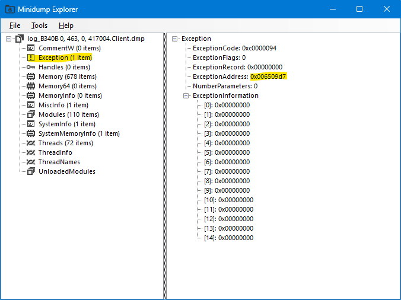
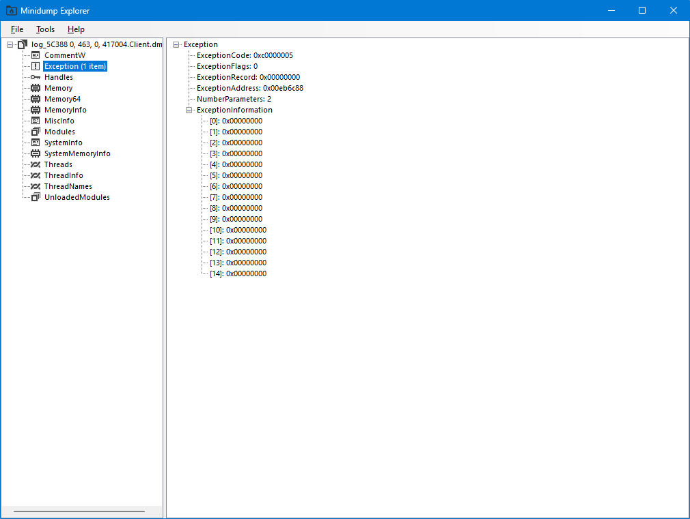

**Rōblox (v463) might sometimes crash on me.**

As of 2025-07-07, there are two common address locations where Rōblox can crash randomly. The solution is as follows:

1. In the Player's `ClientAppSettings.json`, set `DFIntAnalyticsNS1CDNProbeChancePercent` to 0, and
2. Apply the patches from [`./v463-client.1337`](./v463-client.1337).

## Why?

I've provided some client-sided minidumps to find out.

### For Solution (1)

Using [MinidumpExplorer](https://github.com/GregTheDev/MinidumpExplorer/releases/tag/v0.8) on [`./log_B340B_0,_463,_0, 417004.Client.dmp`](./log_B340B_0,_463,_0,_417004.Client.dmp):



They basically point to a `0xC0000094` (integer-division-by-zero) error at address `06509D7`.

```
006509D7 | F7F6                     | div     esi
```

Makes sense.

---

About 20 instructions after, I see a string reference to `"/_/_/origin-1px.gif"`.

```
...
00650A2A | 50                       | push    eax                                                      |
00650A2B | E8 20E0E700              | call    robloxplayerbeta.14CEA50                                 |
00650A30 | 83C4 04                  | add     esp, 0x4                                                 |
00650A33 | 84C0                     | test    al, al                                                   |
00650A35 | 74 2C                    | je      robloxplayerbeta.650A63                                  |
00650A37 | 68 BC77F401              | push    robloxplayerbeta.1F477BC                                 | 1F477BC:"/_/_/origin-1px.gif"
00650A3C | 8D8D 30FFFFFF            | lea     ecx, dword ptr ss:[ebp - 0xD0]                           |
00650A42 | E8 E9649700              | call    robloxplayerbeta.FC6F30                                  |
00650A47 | 84C0                     | test    al, al                                                   |
00650A49 | 75 14                    | jne     robloxplayerbeta.650A5F                                  |
00650A4B | 68 D077F401              | push    robloxplayerbeta.1F477D0                                 | 1F477D0:"/_/_/1px.gif"
...
```

We go back (up) many instructions until we see a very far conditional-jump statement at `00650794`.

```
0065078E | 3B15 4C8B6902            | cmp     edx, dword ptr ds:[0x2698B4C]
00650794 | 0F83 8B030000            | jae     robloxplayerbeta.650B25
```

This statement is preceded by a comparison to a value at a constant address `2698B4C`. Rōblox's FFlags are usually saved in these constant addresses. Note the added `{{TARGET}}` annotation here.

```
004DED80 | 6A 02                    | push    0x2                                                      |
004DED82 | 68 4C8B6902              | push    robloxplayerbeta.2698B4C                                 | {{TARGET}}
004DED87 | 68 F85FF401              | push    robloxplayerbeta.1F45FF8                                 | 1F45FF8:"AnalyticsNS1CDNProbeChancePercent"
004DED8C | E8 CFA20301              | call    robloxplayerbeta.1519060                                 |
004DED91 | 83C4 0C                  | add     esp, 0xC                                                 |
004DED94 | A3 FC8B6902              | mov     dword ptr ds:[0x2698BFC], eax                            |
004DED99 | C3                       | ret                                                              |
```

---

By default, `DFIntAnalyticsNS1CDNProbeChancePercent` is set to `5`. I guess there is a 5% chance that we crash each time we do something. Unreliable!

We should set that to `0` so that this specific divide-by-zero error never happens.

### For Solution (2)

Using [MinidumpExplorer](https://github.com/GregTheDev/MinidumpExplorer/releases/tag/v0.8) on [`./log_5C388_0,_463,_0, 417004.Client.dmp`](./log_5C388_0,_463,_0,_417004.Client.dmp):



They basically point to a `0xC0000005` (access-violation) error at address `00EB6C88`.

The changes in [`./v463-client.1337`](./v463-client.1337) skip the function call in which `00EB6C88` resides (more information can be provided upon request).
