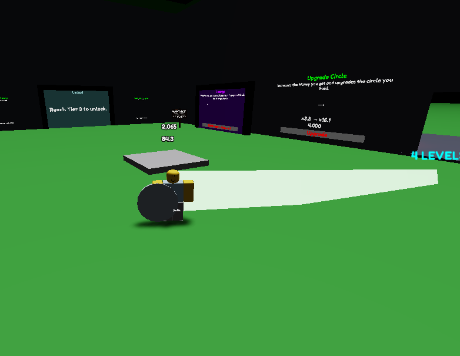
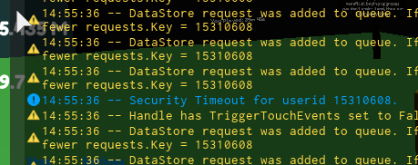

_Referring to [this issue](https://github.com/Windows81/Roblox-Freedom-Distribution/issues/13#issuecomment-2389637948)_

In some cases, the 2021E RCC disconnects clients with an _error 266_ some time after joining.

The dev console says it's a "Security timeout" by RCCService.

If you're having problems, use [`Security Timeout.1337`](./v463-server.1337) with x32dbg on the 2021E RCC.

Pre-patched versions (updated as of 2024-10-02) are in [`Server.zip`](./Server.zip).

**Don't overwhelm yourself spending too much dwelling on the material. If you need any help, it'll save you time to contact VisualPlugin.**
