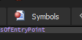
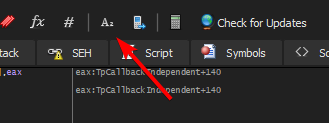
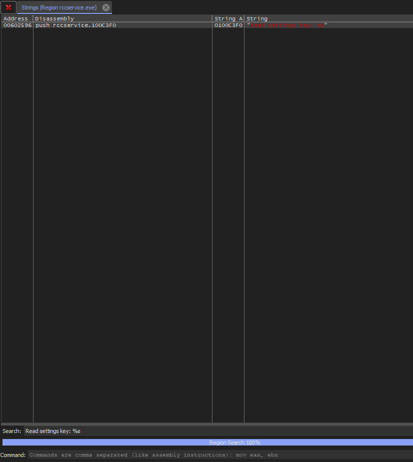
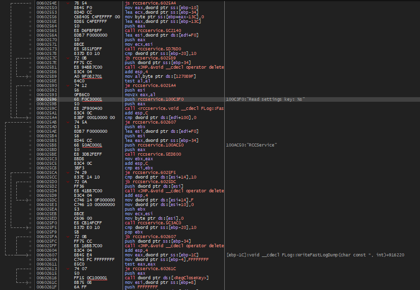
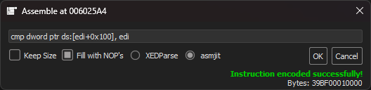
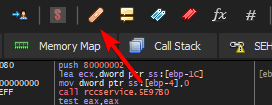

***Note:** This guide is not intended for Rōblox Freedom Distribution; it targets versions significantly older than 0.347 (released in July 2018).*

We've included the guide anyways for anyone who may need it.

Credit to *SomeoneInTheWorld* for being the original author (@yakovexplorer on GitHub).

# Force ~2017 RCCService to Fetch FFlags

For some reason, Roblox decided that the "RCCService" FFlags should be only fetched when a particular key is present in the registry. We should make it fetch FFlags no matter what.

This guide is useful for launchers, and maybe some revivals. This guide is useless for 2018+ RCCServices, as they already fetch FFlags no matter what.

## Patching Guide

A sample patch for is avaliable [here](v227-server.1337) for `RCCService.exe` v227 (early 2016).

### (1) Searching

Search for `"Read settings key: %s"` in user-module string references

Open x32dbg with your RCCService executable. Then click on "Symbols".



Find your executable name and double-click on it. You must have been dropped back to the CPU tab. If not, then manually go to the CPU tab.<br>
Then click the little "Az" icon in the top bar.



Then you will be in the "References" tab. Wait until the progress bar at the bottom finishes, and type in the "Search:" field the phrase "Read settings key: %s", like this:



Double click on the reference found.

### (2) Assembly

The hardest part. You might see a lot of instructions like these now:



First things first, find a `js` instruction above these 6:

```
00602550 | 8B45 F0                  | mov eax,dword ptr ss:[ebp-10]           |
00602553 | 8D4D CC                  | lea ecx,dword ptr ss:[ebp-34]           |
00602556 | C68405 C4FEFFFF 00       | mov byte ptr ss:[ebp+eax-13C],0         |
0060255E | 8D85 C4FEFFFF            | lea eax,dword ptr ss:[ebp-13C]          |
00602564 | 50                       | push eax                                |
00602565 | E8 D6FBFBFF              | call rccservice.5C2140                  |
```

Select it, press space, change `js` to `jmp` and press OK. It must look like this now:


After you have done that, find this instruction:


Select it, press space, change `0x00` to `edi` like the image below and press OK.

**WARNING: Make sure you have "Fill with NOP's" enabled, otherwise it will eat the "je" instruction!**



You are done now. Press the band-aid icon in the topbar:



Click "Patch", and save the executable.

## Background

This patch was derived from [the following code](https://github.com/Jxys3rrV/roblox-2016-source-code/blob/4de2dc3a380e1babe4343c49a4341ceac749eddb/RCCService/RCCServiceSoapServiceImpl.cpp#L1388C1-L1405C3) in the 2016 source:
```cpp
if (settingsKey.length() == 0)
{
  CRegKey key;
  if (SUCCEEDED(key.Open(HKEY_LOCAL_MACHINE, "Software\\ROBLOX Corporation\\Roblox\\", KEY_READ))) 
  {
    CHAR keyData[MAX_PATH];
    ULONG bufLen = MAX_PATH-1;
    if (SUCCEEDED(key.QueryStringValue("SettingsKey", keyData, &bufLen))) 
    {
      keyData[bufLen] = 0;
      settingsKey = std::string(keyData);
      FASTLOGS(FLog::RCCServiceInit, "Read settings key: %s", settingsKey);
    }
  }
  
  if (settingsKey.length() != 0)
    settingsKey = "RCCService" + settingsKey;
}
```

