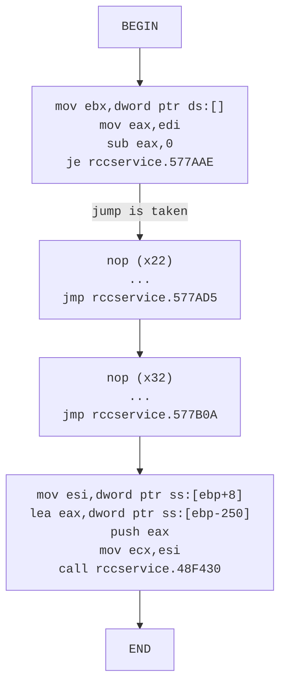
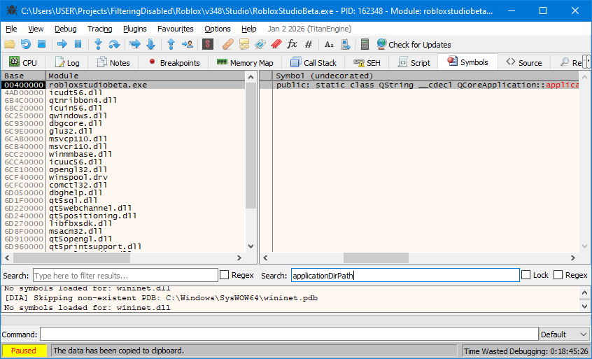

By default, Rōblox stores settings in `%LocalAppData%\Roblox`. If you have both modern Rōblox and RFD installed, we'll find file conflicts.

For example, if you use RFD then re-launch modern Rōblox, some settings will be lost (such as automatic translation being re-enabled after you manually disabled it in modern Rōblox).

Let's fix it.

## Quick Guide

1. Search in user-module string references for `"logs"`. Click any result.

2. Navigate to the location of the next `call` through the disassembler.

   - If you happen to see a call to `GetModuleFileNameW` somewhere in the first 30 or so instructions, you're in the right place.

3. Keep scrolling down until you find a reference to `SHGetFolderPathAndSubDir`.

   - In v348, it looks like `mov ebx,dword ptr ds:[<SHGetFolderPathAndSubDir>]`. This reference should only appear once in this entire function.
   - In v463, that instead is `call <JMP.&SHGetFolderPathAndSubDirW>`. Here, this `call` statement appears twice, with the first being about 10 instructions before the second. _Pick the second one_.

4. Searching about 20 lines in either direction, keep a note of nearby statement(s) either like `or eax,1C` or `or ebx,23`.

   - **The constant must be `1C` or `23`**, but the specific register being used is not.
   - The statement also _must_ be an `or` statement.
   - If there are multiple, keep note of them all.

5. Also keep a note of the offset of `ebp` for a particular string buffer whose address gets pushed into the stack.

   - In v348, the offset is `0x264` [from `lea ecx,dword ptr ss:[ebp-250]`].
   - In v463, the offset is `0x264` [from `lea ecx,dword ptr ss:[ebp-264]`].

6. Surrounding the `or` statement(s) from step (4), fill all their surrounding instructions with `nop`.

   - If there are multiple from step (4), apply the same procedure each of these times.
   - Going up, keep noping until you find a statement like `jmp`, `jne`, `je`, etc.
   - Going down, keep noping until you find a line that _receives_ a branch.

7. If step (6) yields multiple regions, bridge them with unconditional `jmp`.

   - For example, let's say that the final byte at one region has an address of `001B5C35`, and the first byte of the next region is `001B5C43`. Since the ranges are near each other, and short jumps take up two bytes, we occupy the last two bytes of the region (`001B5C34` thru `001B5C35`) with `jmp 001B5C43`.

8. From there, insert the x86 instructions that I wrote in [Appendix A](#appendix-a). Each version of Rōblox operates completely differently. Even binaries of the same numbered version of Player, Studio, and RCC may differ.

This is by no means a complete guide. A lot of details are up to interpretation and require further testing.

---

## Redirecting _Local_ AppData

Look at this method [in the 2016 source](https://github.com/Jxys3rrV/roblox-2016-source-code/blob/4de2dc3a380e1babe4343c49a4341ceac749eddb/App/util/Win/FileSystem.cpp#L27C1-L27C99):

```cpp
boost::filesystem::path getUserDirectory(bool create, FileSystemDir dir, const char *subDirectory)
```

The `dir` argument is interesting to me. Depending on its value, the result calculates the file-save path for images, videos, and even the EXE's directory itself.

**Our goal is to alter execution flow for when the `dir` argument is `DirAppData` whilst keeping all other flows intact.**

```cpp
enum FileSystemDir
{
    DirAppData = 0,
    DirPicture,
    DirVideo,
    DirExe
};
```

By default, if you are running a Rōblox executable at `C:\Users\USER\Projects\FilteringDisabled\Roblox\v348\Server\*.exe`, the expected result will be a path at `C:\Users\USER\AppData\Local\Roblox\`.

We want these files to be saved at a relative path of the user's choosing. It can be controlled by a fast variable named `FStringUS20608`.

Looking through other places in the codebase which call the method named `getUserDirectory`, I found [this](https://github.com/Jxys3rrV/roblox-2016-source-code/blob/4de2dc3a380e1babe4343c49a4341ceac749eddb/CSG/CSGKernel.cpp#L190):

```cpp
boost::filesystem::path path = RBX::FileSystem::getUserDirectory(true, RBX::DirAppData, "logs");
```

Notice here the interesting string `"logs"`.

### Finding `getUserDirectory`

Let's open up x32dbg using the 2018E (v348) `RCCService.exe`.

Then search for user strings.


If you get multiple results, clicking on just one will suffice.

```
004973D5 | 68 64E50B01              | push rccservice.10BE564                                        | 10BE564:"logs"
004973DA | 6A 00                    | push 0                                                         |
004973DC | 8D45 D8                  | lea eax,dword ptr ss:[ebp-28]                                  |
004973DF | C745 FC 00000000         | mov dword ptr ss:[ebp-4],0                                     |
004973E6 | 6A 01                    | push 1                                                         |
004973E8 | 50                       | push eax                                                       |
004973E9 | E8 C2040E00              | call rccservice.5778B0                                         |
```

The very next function call (in this case) is to `robloxplayerbeta.5778B0`. Let's look inside!

### Finding Available Code Regions

The `DirAppData` enum has _exclusive_ code coverage in **two** areas, according to the 2016 source-code archive.

#### (R1)

```cpp
switch (dir)
{
	case DirAppData:
		hr = SHGetFolderPathAndSubDirW(NULL, CSIDL_LOCAL_APPDATA | flags, NULL, SHGFP_TYPE_CURRENT, robloxDir.native().c_str(), pathBuffer);
		break;
	case DirPicture:
		hr = SHGetFolderPathAndSubDirW(NULL, CSIDL_MYPICTURES | flags, NULL, SHGFP_TYPE_CURRENT, robloxDir.native().c_str(), pathBuffer);
		break;
	case DirVideo:
		hr = SHGetFolderPathAndSubDirW(NULL, CSIDL_MYVIDEO | flags, NULL, SHGFP_TYPE_CURRENT, robloxDir.native().c_str(), pathBuffer);
		break;
	default:
		RBXASSERT(false);
		hr = S_FALSE;
		break;
}
```

This region has some of the same call to `SHGetFolderPathAndSubDirW`, which x32dbg conveniently denotes for us below:


Notice that the address pointing to `SHGetFolderPathAndSubDirW` is stored in register `ebx` at instruction `00577A5C`.

Why? The C++ code shows `SHGetFolderPathAndSubDirW` being referenced _thrice_, since there are three switch-cases which use it. This is definitely a special compiler optimisation from MSVC++.

The subsequent `je` and `sub` statements must correspond to the switch-case. It should be safe to assume that the `eax` register being processed is the enum argument `dir` in C++.

From earlier, we determined that `dir` should be equal to zero. So we want to trace x86 execution for when `eax` is _originally_ equal to `0`. This leads us to the highlighted region: from `00577AAE` to `00577AC3`.

Therefore, no other enum values for `dir` can reach this code segment. It should be safe to `nop` the entire region.


The unconditional `jmp` immediately after the highlighted region is a bridge for the _next_ available region of code to discuss. Fortunately, these two code regions are near each other.

#### (R2)

```cpp
if ((hr!=S_OK) && (dir == DirAppData))
{
    // Try this one:
    hr = SHGetFolderPathAndSubDirW(NULL, CSIDL_COMMON_APPDATA | flags, NULL, SHGFP_TYPE_CURRENT, robloxDir.native().c_str(), pathBuffer);
}
```

This code's execution flow depends on if the previous region yields failure via a C++ variable `hr`. Since `SHGetFolderPathAndSubDirW` is being used again, it is reasonable to assume that `call ebx`.


Combining the two segments together, we can trace this execution graph:


Note that from (R1), these constants map into [the following hex values](https://tarma.com/support/im9/using/symbols/functions/csidls.htm):

- `CSIDL_LOCAL_APPDATA` corresponds with 0x1C.
- `CSIDL_MYPICTURES` corresponds with 0x27.
- `CSIDL_MYVIDEO` corresponds with 0x0E.

In the v348 compilation, these constants can be found being taken a bitwise-or with statements such as `or eax,1C`, `or eax,27`, et c.

I also found an `or ebx,23` statement when looking through the compiled code in v463. Therefore, we should add:

- `CSIDL_COMMON_APPDATA` corresponds with 0x23.

There are two registers being checked in x86: `eax` and `edi`. We know that _one_ of them corresponds with the C++ variable `dir`. It is safe to eliminate `eax` since both comparisons are made _immediately_ after a function call at `00577ACD`.

It is therefore safe to completely skip the _second_ condition and make that jump unconditional. This leave us with plenty more bits to `nop`.




To allow more space for our own own instructions, I've had to move some of the jumps in addition to making them unconditional. For example,

```diff
-00577AC0 | 50                       | push eax
-00577AC1 | 8BC6                     | mov eax,esi
-00577AC3 | 83C8 1C                  | or eax,1C
+00577AC0 | 90                       | nop
+00577AC1 | 90                       | nop
+00577AC2 | 90                       | nop
+00577AC3 | 90                       | nop
+00577AC4 | EB 0F                    | jmp rccservice.577AD5
00577AC6 | 6A 00                    | push 0
```

```diff
00577AD1 | 74 37                    | je rccservice.577B0A
-00577AD3 | 85FF                     | test edi,edi
-00577AD5 | 75 1C                    | jne rccservice.577AF3
+00577AD3 | EB 22                    | jmp rccservice.577AF7
+00577AD5 | 90                       | nop
+00577AD6 | 90                       | nop
...
-00577AF3 | 85C0                     | test eax,eax
-00577AF5 | 74 13                    | je rccservice.577B0A
+00577AF3 | 90                       | nop
+00577AF4 | 90                       | nop
+00577AF5 | EB 13                    | jmp rccservice.577B0A
00577AF7 | 8B75 08                  | mov esi,dword ptr ss:[ebp+8]
```

### Deciding What Code to Assemble

By looking at the assembly, we find that:

- **`ebp - 0x250`** is **the first character** of a `wchar_t[]` buffer used in SHGetFolderPathAndSubDirW branches; we redirect "subDirectory" to this address in our patches for AppData.
- **`ebp + 0x14`** is **a pointer** to the `const char* subDirectory` function argument.

Therefore, I want the buffer at `ebp - 0x250` to be filled like the following:

- a `wchar*` string `L"../../../logs"` for when `subDirectory` is equal to narrow-character string `"logs"`.

- a `wchar*` string `L"../../../"` for when `subDirectory` an empty string or a null pointer.

After much trial and error, I devised this clever 47-byte-long routine in [Appendix A](#appendix-a).

All I need to do is fill the nops in with code assembled and sequenced from the instructions above.

Credit to `ebkeyesa` and `ayoeggz` on Twitch for nothing.

### Additional Considerations

In Studio (and only in Studio), there is a string `"/AppData/Local/Roblox"` included in compilation, as per [the 2016 source code](https://github.com/Jxys3rrV/roblox-2016-source-code/blob/4de2dc3a380e1babe4343c49a4341ceac749eddb/RobloxStudio/RobloxSettings.cpp#L81).

In my view, this is bad practice since the code reduplicates functionality of `getUserDirectory` to retrieve the path to `AppData/Local/Roblox`.

```cpp
AppSettings::AppSettings()
{

  ...


#ifdef _WIN32
	m_tempLocation = QDir::homePath() + "/AppData/Local/Roblox";
#else
	m_tempLocation = QDesktopServices::storageLocation(QDesktopServices::DocumentsLocation) + "/Roblox";
#endif
	if(!QFile::exists(m_tempLocation))
		QDir().mkpath(m_tempLocation);
}
```

This roughly corresponds with the following assembly code:

```
00725EC0 | 8D45 D8               | lea eax,dword ptr ss:[ebp-28]                                                             |
00725EC3 | 50                    | push eax                                                                                  |
00725EC4 | FF15 EC3B4301         | call dword ptr ds:[<public: static class QString __cdecl QDir::homePath(void)>]           |
00725ECA | 68 EC787F01           | push robloxstudiobeta.17F78EC                                                             | 17F78EC:"/AppData/Local/Roblox"
00725ECF | 50                    | push eax                                                                                  |
00725ED0 | 8D45 D4               | lea eax,dword ptr ss:[ebp-2C]                                                             |
00725ED3 | C645 FC 23            | mov byte ptr ss:[ebp-4],23                                                                |
00725ED7 | 50                    | push eax                                                                                  |
00725ED8 | E8 736FD8FF           | call robloxstudiobeta.4ACE50                                                              |
```

It seems that `robloxstudiobeta.4ACE50` is responsible for concatenating the result of `QDir::homePath` and `"/AppData/Local/Roblox"`. The result is then stored in a C++ class-variable named `m_tempLocation`.

Unlike in `getUserDirectory`, the types being utilised are `QString` rather than `boost::filesystem::path`. And I don't want to change types to avoid also needing to mess with destructors. So I can't directly call `getUserDirectory` to get the path I want.

For this, I wouldn't mind having `AppSettings` resolve to a temporary path in the same directory as `RobloxStudioBeta.exe`, rather than go up some levels like I previously discussed in `getUserDirectory`. It wouldn't matter since I don't see any files being made with the path retrieved from `m_tempLocation` under normal Studio usage anyways.

Here are the changes I did:

- Zeroed the entire `"/AppData/Local/Roblox"` string beginning at `17F78EC`, and
- Changed `QDir::homePath(void)` to `QCoreApplication::applicationDirPath(void)` by subtracting `0x8` from the `ds:` address.

To make sure of the `0x8` offset - that you have the right address for `QCoreApplication::applicationDirPath(void)`, consult the _Symbols_ tab and search in the `robloxstudiobeta.exe` module for imports of `applicationDirPath`.



```patch
00725EC0 | 8D45 D8               | lea eax,dword ptr ss:[ebp-28]
00725EC3 | 50                    | push eax
-00725EC4 | FF15 EC3B4301         | call dword ptr ds:[<public: static class QString __cdecl QDir::homePath(void)>]
+00725EC4 | FF15 E43B4301         | call dword ptr ds:[<public: static class QString __cdecl QCoreApplication::applicationDirPath
```

```patch
017F78DC  65 64 00 00 43 72 61 73 68 4D 65 6E 75 00 00 00  ed..CrashMenu...
-017F78EC  2F 41 70 70 44 61 74 61 2F 4C 6F 63 61 6C 2F 52  /AppData/Local/R
-017F78FC  6F 62 6C 6F 78 00 00 00 77 77 77 2E 00 00 00 00  oblox...www.....
+017F78EC  00 00 00 00 00 00 00 00 00 00 00 00 00 00 00 00  ................
+017F78FC  00 00 00 00 00 00 00 00 77 77 77 2E 00 00 00 00  ........www.....
```

### Appendix A

For 32-bit installations, utilise these instructions:

```x86
mov eax, 0x002f002e
lea edi, [ebp - 0x250] // 0x250 may need to be replaced by 0x264.
push 3
pop ecx
l1:
mov dword ptr [edi], eax
mov dword ptr [edi+2], eax
add edi, 6
loop l1

xor ebx,ebx
mov eax,dword ptr ss:[ebp+0x14]
test eax,eax
je l3
l2:
mov cl,byte ptr ds:[eax+ebx]
l3:
mov word ptr ss:[edi+ebx*2],cx
inc ebx
inc ecx
loop l2
```

```
b8 2e 00 2f 00
8d bd b0 fd ff ff // The hex bytes in this instruction may change depending on our `ebp` offset [0x250 or 0x264]
6a 03
59
89 07
89 47 02
83 c7 06
e2 f6
// This `e2` loop instruction is different if you're splitting the above code block into multiple pieces.
// Make sure the destination is at the first `mov` instruction (`89 07`).

31 db
8b 45 14
85 c0
74 03
8a 0c 18
36 66 89 0c 5f
43
41
e2 f4
```

For 64-bit installations, utilise these instructions:

```
lea rdi,qword ptr ss:[rbp-60]
mov eax, 0x2F002E
push 3
pop rcx
l1:
mov dword ptr ds:[rdi],eax
mov dword ptr ds:[rdi+2],eax
add rdi,6
loop l1

xor rbx,rbx
test r15,r15
cmove r15,rdi
movzx ecx,byte ptr ds:[r15+rbx]
mov word ptr ds:[rdi+rbx*2],cx
inc ebx
inc ecx
loop 141B65D25
```
