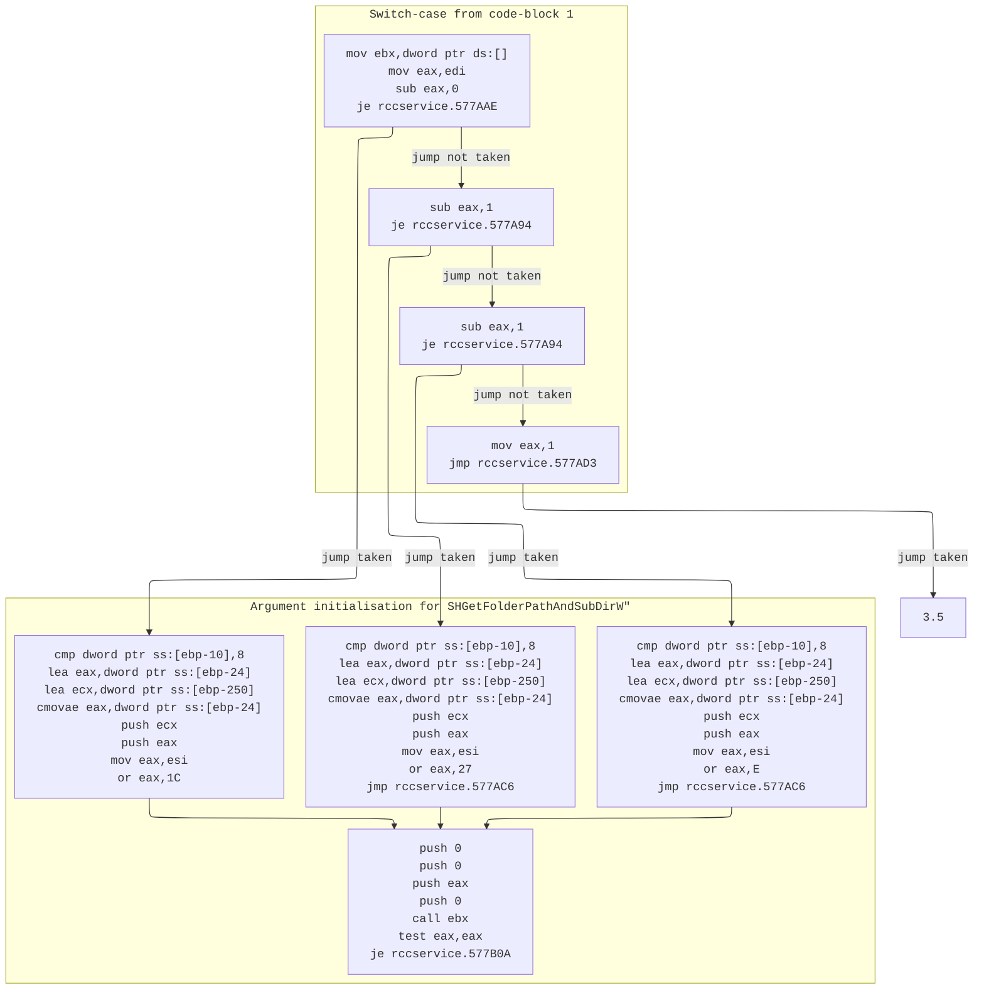
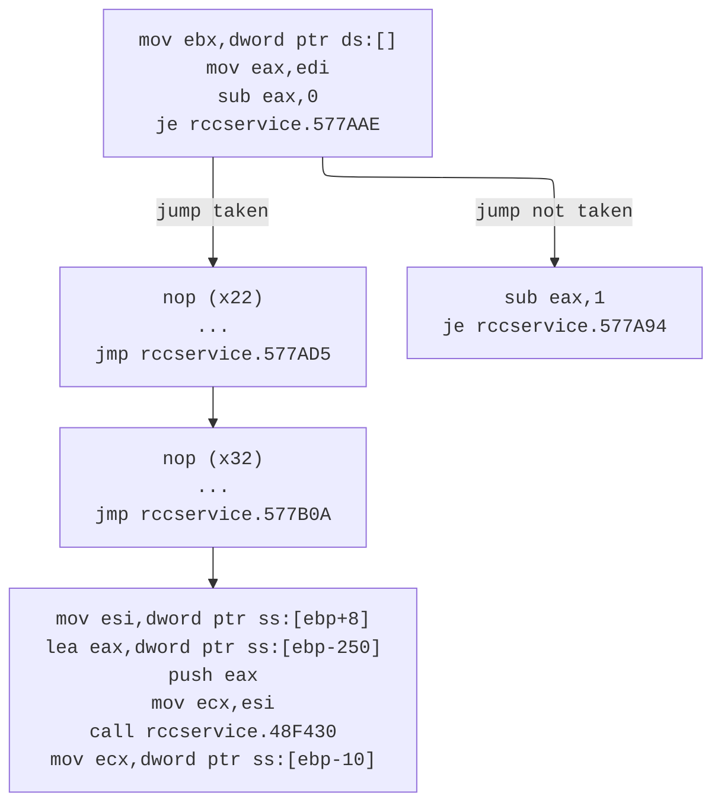

By default, Rōblox stores settings in `%LocalAppData%\Roblox`. If you have both modern Rōblox and RFD installed, we'll find file conflicts.

For example, if you use RFD then re-launch modern Rōblox, some settings will be lost (such as automatic translation being re-enabled after you manually disabled it in modern Rōblox).

Let's fix it.

---

## Objective

Look at this method [in the 2016 source](https://github.com/Jxys3rrV/roblox-2016-source-code/blob/4de2dc3a380e1babe4343c49a4341ceac749eddb/App/util/Win/FileSystem.cpp#L27C1-L27C99):

```cpp
boost::filesystem::path getUserDirectory(bool create, FileSystemDir dir, const char *subDirectory)
```

The `dir` argument is interesting to me. Depending on its value, the result calculates the file-save path for images, videos, and even the EXE's directory itself.

**Our goal is to alter execution flow for when the `dir` argument is `DirAppData` whilst keeping all other flows intact.**

```cpp
enum FileSystemDir
{
    DirAppData = 0,
    DirPicture,
    DirVideo,
    DirExe
};
```

By default, if you are running a Rōblox executable at `C:\Users\USER\Projects\FilteringDisabled\Roblox\v348\Server\*.exe`, the expected result will be a path at `C:\Users\USER\AppData\Local\Roblox\`.

We want these files to be saved at a relative path of the user's choosing. It can be controlled by a fast variable named `FStringUS20608`.

Looking through other places in the codebase which call the method named `getUserDirectory`, I found [this](https://github.com/Jxys3rrV/roblox-2016-source-code/blob/4de2dc3a380e1babe4343c49a4341ceac749eddb/CSG/CSGKernel.cpp#L190):

```cpp
boost::filesystem::path path = RBX::FileSystem::getUserDirectory(true, RBX::DirAppData, "logs");
```

Notice here the interesting string `"logs"`.

## Using x32dbg

Let's open up x32dbg using the 2018E (v348) `RCCService.exe`.

Then search for user strings.


If you get multiple results, clicking on just one will suffice.

```
004973D5 | 68 64E50B01              | push rccservice.10BE564                                        | 10BE564:"logs"
004973DA | 6A 00                    | push 0                                                         |
004973DC | 8D45 D8                  | lea eax,dword ptr ss:[ebp-28]                                  |
004973DF | C745 FC 00000000         | mov dword ptr ss:[ebp-4],0                                     |
004973E6 | 6A 01                    | push 1                                                         |
004973E8 | 50                       | push eax                                                       |
004973E9 | E8 C2040E00              | call rccservice.5778B0                                         |
```

The very next function call (in this case) is to `robloxplayerbeta.5778B0`. Let's look inside!

### Finding Available Code Regions

The `DirAppData` enum has _exclusive_ code coverage in **two** areas, according to the 2016 source-code archive.

#### 1.

```cpp
switch (dir)
{
	case DirAppData:
		hr = SHGetFolderPathAndSubDirW(NULL, CSIDL_LOCAL_APPDATA | flags, NULL, SHGFP_TYPE_CURRENT, robloxDir.native().c_str(), pathBuffer);
		break;
	case DirPicture:
		hr = SHGetFolderPathAndSubDirW(NULL, CSIDL_MYPICTURES | flags, NULL, SHGFP_TYPE_CURRENT, robloxDir.native().c_str(), pathBuffer);
		break;
	case DirVideo:
		hr = SHGetFolderPathAndSubDirW(NULL, CSIDL_MYVIDEO | flags, NULL, SHGFP_TYPE_CURRENT, robloxDir.native().c_str(), pathBuffer);
		break;
	default:
		RBXASSERT(false);
		hr = S_FALSE;
		break;
}
```

This region has some of the same call to `SHGetFolderPathAndSubDirW`, which x32dbg conveniently denotes for us below:


Notice that the address pointing to `SHGetFolderPathAndSubDirW` is stored in register `ebx` at instruction `00577A5C`.

Why? The C++ code shows `SHGetFolderPathAndSubDirW` being referenced _thrice_, since there are three switch-cases which use it. This is definitely a special compiler optimisation from MSVC++.

The subsequent `je` and `sub` statements must correspond to the switch-case. It should be safe to assume that the `eax` register being processed is the enum argument `dir` in C++.

From earlier, we determined that `dir` should be equal to zero. So we want to trace x86 execution for when `eax` is _originally_ equal to `0`. This leads us to the highlighted region: from `00577AAE` to `00577AC3`.

Therefore, no other enum values for `dir` can reach this code segment. It should be safe to `nop` the entire region.


The `jmp` immediately after the highlighted region is a bridge for the _next_ available region of code to discuss. Fortunately, these two code regions are near each other.

#### 2.

```cpp
...
if ((hr!=S_OK) && (dir == DirAppData))
{
    // Try this one:
    hr = SHGetFolderPathAndSubDirW(NULL, CSIDL_COMMON_APPDATA | flags, NULL, SHGFP_TYPE_CURRENT, robloxDir.native().c_str(), pathBuffer);
}
...
```

Combining the two segments together, we can trace this execution graph:




This code is designed to execute only if the previous region yields failure via a C++ variable `hr`. Since `SHGetFolderPathAndSubDirW` is being used again, it is reasonable to assume that `call ebx`.

There are two registers being checked in x86: `eax` and `edi`. We know that _one_ of them corresponds with the C++ variable `dir`. It is safe to eliminate `eax` since both comparisons are made _immediately_ after a function call at `00577ACD`.

It is therefore safe to completely skip the _second_ condition and make that jump unconditional. This leave us with plenty more bits to `nop`.




### Deciding What Code to Assemble

By looking at the assembly, we find that:

- **`dword ptr ss:[ebp-0x250]`** is a string buffer used in SHGetFolderPathAndSubDirW branches; we redirect "subDirectory" to this address in our patches for AppData
- **`dword ptr ss:[ebp+0x14]`** corresponds to the `const char *subDirectory` function argument.
